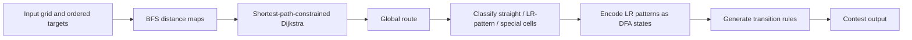

# AHC056 Grid Turing Robot Solver

A C++17 heuristic solver for AtCoder Heuristic Contest 056, **Grid Turing Robot**.

This public-facing branch contains only my solver and documentation. The contest statement, official visualizer, compiled binaries, and third-party tooling are intentionally not redistributed here.

## What this project demonstrates

The solver combines several ideas rather than relying on a single shortest-path routine:

- BFS distance maps for shortest-path constraints
- Dijkstra over `(cell, previous direction)` states
- history-aware penalties that discourage mixing straight and turning behavior on the same cell
- path reconstruction across multiple required targets
- classification of visited cells by behavioral role
- a compact DFA for short left/right turn patterns
- explicit fallback states for cells whose behavior cannot be safely compressed

The result is a constructive pipeline that first chooses a route and then compiles that route into the color/state transition rules required by the problem.

## High-level pipeline



## Repository layout

```text
.
├── src/
│   └── main.cpp          # solver
├── docs/
│   └── approach.md       # design notes and trade-offs
├── .github/workflows/
│   └── ci.yml            # compile check
├── CMakeLists.txt
├── LICENSE
└── README.md
```

## Build

### CMake

```bash
cmake -S . -B build
cmake --build build --config Release
```

### g++ directly

```bash
g++ -std=c++17 -O2 -Wall -Wextra -Wpedantic src/main.cpp -o ahc056_solver
```

The solver reads one contest instance from standard input and writes the constructed solution to standard output.

## Design notes

The core routing step keeps every segment on a shortest path in grid distance, but chooses among those shortest paths using additional penalties. In particular, it prefers a cell to keep a consistent semantic role across visits: a cell that has historically been used for turning is expensive to reuse as a straight-through cell, and vice versa.

After routing, short sequences of left/right turns are represented by suffix states of a small DFA. More irregular cells—such as cells containing a backtrack or a mixture of incompatible behaviors—fall back to visit-indexed special states. This keeps the common case compact without sacrificing correctness for unusual route structure.

See [`docs/approach.md`](docs/approach.md) for a more detailed walkthrough.

## Scope and limitations

This repository is a contest solver, not a general robotics library. The implementation is tuned to the AHC056 constraints and output model. Some heuristics are deliberately pragmatic rather than theoretically optimal.

## Problem reference

AtCoder Heuristic Contest 056: Grid Turing Robot

- Official contest site: https://atcoder.jp/contests/ahc056

## License

The source code and original documentation in this repository are released under the MIT License. AtCoder problem statements, names, and official tools belong to their respective owners and are not included in this repository.
